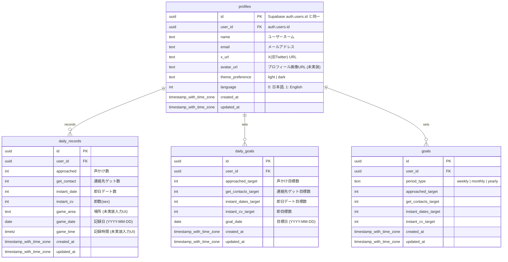

## ER図

## テーブル設計補足

### profiles
- Supabase Auth のユーザー作成時にトリガーで自動生成される（または手動insert）
- `id` は `auth.users.id` と同一の UUID
- `theme_preference`: デフォルトは `dark`
- `language`: デフォルトは `0`（日本語）

### daily_records
- 1ユーザー・1日につき1レコード（`user_id` + `game_date` でユニーク）
- カウンターはインクリメント/デクリメントで更新
- `game_area`、`game_time` は詳細情報入力UI実装後に使用予定

### daily_goals
- 1ユーザー・1日につき1レコード（`user_id` + `goal_date` でユニーク）
- ホーム画面のプログレスバー表示に使用

### goals
- 週次/月次/年次の目標を管理
- `period_type` の値: `weekly` | `monthly` | `yearly`
- 注意: 日次目標は `daily_goals` テーブルで管理（`goals` テーブルは使用しない）

## RLS ポリシー

全テーブル共通: ユーザーは自分のデータ（`user_id = auth.uid()`）のみ参照・作成・更新可能。
