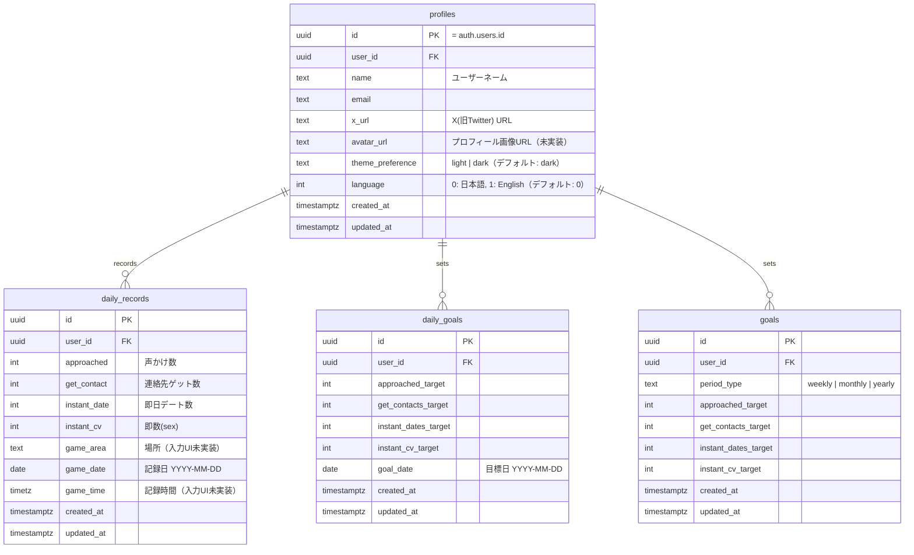

# Rizz App — 設計仕様書

**作成日**: 2026-03-27
**対象**: チームメンバー・AI実装支援

---

## 目次

1. [プロジェクト概要](#1-プロジェクト概要)
2. [MVP実装状況](#2-mvp実装状況)
3. [技術スタック](#3-技術スタック)
4. [データベース設計](#4-データベース設計)
5. [画面構成](#5-画面構成)
6. [コア処理フロー](#6-コア処理フロー)
7. [API設計](#7-api設計)
8. [ディレクトリ構造](#8-ディレクトリ構造)
9. [非機能要件](#9-非機能要件)
10. [タスク管理](#10-タスク管理)
11. [スケジュール](#11-スケジュール)

---

## 1. プロジェクト概要

ストリートナンパの実績を記録・分析するためのモバイルアプリケーション。

声かけ数・連絡先獲得数・即日デート数・即数などの基本指標を記録し、日次/週次/月次/年次での分析機能を提供する。

### 対象者

- ストリートナンパを行う個人
- ナンパスクールの運営者

### ブランドカラー

| 役割 | 名称 | カラーコード |
|------|------|------------|
| 主要背景 | リッチブラック | `#0A0F23` |
| ロゴ・見出しハイライト | アンティークゴールド | `#C09E5C` |
| ヘッダー/フッター背景 | ダークヘッダー | `#080C1A` |
| カード・ボタン背景 | チャコールグレー | `#36454F` |
| 重要アクション | バーガンディレッド | `#800020` |
| 枠線・装飾 | プラチナシルバー | `#E5E4E2` |
| グラフ・プログレス終端 | メタリックゴールド | `#D4AF37` |

- **基本テキスト**: 白 `#FFFFFF`
- **プログレスバーグラデーション**: `#0A0F23` → `#1A2342` → `#D4AF37`

---

## 2. MVP実装状況

### ✅ 実装済み

| 機能 | 詳細 |
|------|------|
| 基本カウンター | 声かけ・連絡先ゲット・即日デート・即のワンタップ記録。デクリメントも可 |
| 目標設定 | 日・週・月・年の期間別目標設定 |
| プログレスバー | ホーム画面で現在値/目標値の進捗を表示 |
| 認証 | メール/パスワードのサインアップ・サインイン・ログアウト |
| 設定 | ユーザーネーム・X URL・パスワード変更 |
| テーマ切替 | ライト/ダークモード切替（profilesに保存） |
| 言語切替 | 日本語/英語切替（profilesに保存） |
| オフライン対応 | AsyncStorageキャッシュ・変更キュー・オンライン時自動同期 |

### ❌ 未実装（MVP残タスク）

| 機能 | 詳細 |
|------|------|
| 統計グラフ | `/statistics` 画面はプレースホルダーのみ。Victory Nativeで実装予定 |
| 詳細情報入力 | `game_area`（場所）・`game_time`（時間）の入力UIが未実装 |
| プロフィール画像 | Supabase Storageへのアップロード未実装 |

### 🔮 プレミアム機能（将来計画）

- 時間帯別・場所別の成功率分析
- 全体統計・ランキング（コミュニティ機能）
- CSVエクスポート
- GPS位置情報の自動記録

---

## 3. 技術スタック

### フロントエンド

| 項目 | 採用技術 | バージョン |
|------|---------|---------|
| フレームワーク | Expo + React Native | SDK `~52.0.46` / RN `0.76.9` |
| 言語 | TypeScript | — |
| ナビゲーション | Expo Router | `~4.0.20` |
| UI | React Native Paper | `^5.13.1` |
| グラデーション | expo-linear-gradient | `^14.0.2` |
| 状態管理 | Context API + useReducer | — |
| フォーム | Formik + Yup | `^2.4.6` / `^1.6.1` |
| 国際化 | i18next + react-i18next | `^23.0.3` / `^13.0.0` |
| 日付操作 | date-fns | `^4.1.0` |
| オフラインキャッシュ | AsyncStorage | `^2.1.2` |
| ネットワーク監視 | NetInfo | `^11.4.1` |
| グラフ（未実装） | Victory Native | 導入予定 |

### バックエンド

| 項目 | 採用技術 |
|------|---------|
| BaaS | Supabase (`^2.49.4`) |
| DB | PostgreSQL（Supabase管理） |
| 認証 | Supabase Auth（メール/パスワード） |
| ストレージ | Supabase Storage（プロフィール画像 ❌未実装） |
| セキュリティ | Row Level Security (RLS) |

### デプロイ

- **ビルド**: Expo EAS Build
- **配布**: iOS → App Store / Android → Google Play
- **OTA**: Expo Updates

---

## 4. データベース設計



### テーブル設計補足

- **profiles**: Supabase Auth ユーザー作成時に自動生成。`id` = `auth.users.id`
- **daily_records**: `user_id` + `game_date` でユニーク（1日1レコード）
- **daily_goals**: 日次目標。`user_id` + `goal_date` でユニーク
- **goals**: 週次/月次/年次の目標。日次目標は `daily_goals` で管理（`goals` テーブルには `daily` を保存しない）

### RLS ポリシー

全テーブル共通: `user_id = auth.uid()` のデータのみ SELECT / INSERT / UPDATE 可能

---

## 5. 画面構成

### ルーティング構造

```
app/
├── _layout.tsx              # ルートレイアウト・認証状態でリダイレクト
├── index.tsx                # 初期リダイレクト
├── +not-found.tsx
├── (auth)/                  # 未ログイン時のみアクセス可
│   ├── login.tsx            # ログイン画面
│   └── signup.tsx           # サインアップ画面
└── (tabs)/                  # ログイン済み時のみアクセス可
    ├── index.tsx            # ホーム（カウンター + プログレスバー）
    ├── statistics.tsx       # 統計データ ❌プレースホルダー
    ├── goal-settings.tsx    # 目標設定
    └── settings.tsx         # 設定
```

### 各画面の詳細

#### `(auth)/login` — ログイン
- メールアドレス・パスワード入力（Formik + Yup）
- サインアップ画面へのリンク

#### `(auth)/signup` — サインアップ
- ユーザーネーム・メールアドレス・パスワード入力
- ログイン画面へのリンク

#### `(tabs)/index` — ホーム
- 今日の日付・ユーザー名グリーティング
- 4種類のカウンターボタン（インクリメント/デクリメント）
- 各カウンターのプログレスバー（現在値 / 日次目標）
- リロードボタン（目標・記録の再取得）
- オフライン・エラー状態表示

#### `(tabs)/statistics` — 統計データ ❌未実装
- **予定**: 日次/週次/月次/年次タブ切替
- **予定**: Victory Nativeによるグラフ表示
- **予定**: 声かけ数・連絡先獲得率・即率の可視化

#### `(tabs)/goal-settings` — 目標設定
- 期間タイプ選択（日・週・月・年）
- 各指標の目標値入力
- 保存ボタン

#### `(tabs)/settings` — 設定
- ユーザーネーム変更
- X(旧Twitter)URL 変更
- パスワード変更
- テーマ切替（ライト/ダーク）
- 言語切替（日本語/英語）
- プロフィール画像 ❌未実装

### ボトムタブバー

| タブ | ルート | 説明 |
|------|--------|------|
| ホーム | `/(tabs)/` | カウンター操作 |
| 統計 | `/(tabs)/statistics` | データ分析（未実装） |
| 目標設定 | `/(tabs)/goal-settings` | 期間別目標管理 |
| 設定 | `/(tabs)/settings` | プロフィール・アプリ設定 |

---

## 6. コア処理フロー

### 認証フロー

```
サインアップ:
  メール/パスワード/ユーザーネーム入力
    → Supabase Auth signUp
    → profiles テーブルに name を保存
    → ホーム画面へリダイレクト

サインイン:
  メール/パスワード入力
    → Supabase Auth signInWithPassword
    → JWT を AsyncStorage に保存
    → ホーム画面へリダイレクト

起動時:
  AsyncStorage からセッション復元
    → 有効なセッションあり → ホーム
    → なし → ログイン画面
```

### カウンターインクリメントフロー

```
ボタンタップ
  → RecordContext.incrementCounter(type, date)
  → ローカル状態を即時更新（UI反応）
  → AsyncStorage に変更をキュー登録
  → オンライン時:
      Supabase daily_records に upsert（該当日のレコード更新/新規作成）
  → オフライン時:
      AsyncStorage キューに保存
      ← オンライン復帰時に自動同期
```

### プログレスバー計算

```javascript
const progress = (currentValue / targetValue) * 100;
// 各指標（approached / get_contact / instant_date / instant_cv）に適用
```

### 統計データ取得（実装予定）

```sql
-- 日次統計
SELECT
  game_date,
  approached,
  get_contact,
  instant_date,
  instant_cv,
  CASE WHEN approached > 0
    THEN ROUND((get_contact::NUMERIC / approached) * 100, 2)
  ELSE 0 END AS contact_rate,
  CASE WHEN approached > 0
    THEN ROUND((instant_cv::NUMERIC / approached) * 100, 2)
  ELSE 0 END AS cv_rate
FROM daily_records
WHERE user_id = $1
  AND EXTRACT(YEAR FROM game_date) = $2
  AND EXTRACT(MONTH FROM game_date) = $3
ORDER BY game_date;
```

---

## 7. API設計

Supabase 自動生成 REST API + `supabase-js` クライアントを使用。

### 認証

```typescript
signUp(email, password, name)   // → profiles に name を保存
signIn(email, password)
signOut()
updatePassword(newPassword)
```

### 日次記録 (`daily_records`)

```typescript
getDailyRecord(date: string)                         // 特定日取得
getDailyRecords(startDate: string, endDate: string)  // 期間取得
upsertDailyRecord(record: DailyRecord)               // 作成/更新
incrementCounter(type: CounterType, date: string)    // カウントUP
// type: 'approached' | 'getContact' | 'instantDate' | 'instantCv'
```

### 目標 (`daily_goals` / `goals`)

```typescript
// 日次目標
getDailyGoal(date: string)
upsertDailyGoal({ goal_date, approached_target, ... })

// 週次/月次/年次目標
getGoal(userId, periodType: 'weekly' | 'monthly' | 'yearly')
getAllGoals(userId)
upsertGoal(goalData)
```

### プロフィール (`profiles`)

```typescript
getProfile()
updateProfile({ name?, x_url?, theme_preference?, language? })
changePassword(currentPassword, newPassword)
```

### 主要な型定義

```typescript
type CounterType = 'approached' | 'getContact' | 'instantDate' | 'instantCv'
type PeriodType = 'daily' | 'weekly' | 'monthly' | 'yearly'

interface DailyRecord {
  id: string
  user_id: string
  approached: number
  get_contact: number
  instant_date: number
  instant_cv: number
  game_area?: string
  game_date: string  // YYYY-MM-DD
  game_time?: string // HH:MM:SS
  created_at: string
  updated_at: string
}

interface Profile {
  id: string
  user_id: string | null
  name: string | null
  email: string | null
  x_url: string | null
  theme_preference: 'light' | 'dark'
  language: number  // 0: 日本語, 1: English
  created_at: string
  updated_at: string
}
```

---

## 8. ディレクトリ構造

```
rizz-v4/
├── app/                        # Expo Router（画面）
│   ├── (auth)/                 # ログイン・サインアップ
│   └── (tabs)/                 # メインタブ（ホーム・統計・目標・設定）
│
├── components/                 # UIコンポーネント
│   ├── auth/                   # LoginForm, SignupForm, FormInput, FormButton
│   ├── counter/                # CounterButton, ProgressDisplay
│   ├── goal/                   # GoalForm, NumericInput, PeriodSelector
│   ├── profile/                # ProfileSettings, UsernameForm, PasswordForm, XUrlForm, ThemeToggle
│   └── ui/                     # IconSymbol, TabBarBackground
│
├── contexts/                   # React Context プロバイダー
│   ├── AuthContext.tsx          # Supabase Auth セッション管理
│   ├── CounterContext.tsx       # カウンター・目標値の状態
│   ├── RecordContext.tsx        # 日次記録 + オフラインキュー
│   ├── GoalContext.tsx          # 目標データ + オフラインキュー
│   └── ProfileContext.tsx       # プロフィール・テーマ・言語
│
├── services/                   # Supabase API 連携
│   ├── record.ts               # daily_records CRUD
│   └── profile.ts              # profiles CRUD
│
├── src/                        # 追加ソース
│   ├── services/
│   │   ├── goal.ts             # goals テーブル API
│   │   ├── daily-goals.ts      # daily_goals テーブル API
│   │   └── profile.ts          # プロフィール API（拡張版）
│   ├── libs/
│   │   └── i18n.ts             # i18next 設定
│   ├── schemas/
│   │   └── daily-goals.ts      # Yup バリデーション
│   └── types/
│       ├── database.types.ts   # Supabase 自動生成型
│       ├── goal.ts
│       └── profile.ts
│
├── lib/types/                  # 共通型定義
│   ├── record.ts               # CounterType, PeriodType, DailyRecord 等
│   └── goal.ts
│
├── hooks/                      # テーマ系フック
│   └── useColorScheme.ts
│
├── locales/                    # i18n
│   ├── ja.json
│   └── en.json
│
└── constants/                  # カラー定数
```

### Context の責務

| Context | 責務 |
|---------|------|
| `AuthContext` | Supabase Auth セッション管理・ログイン/アウト |
| `CounterContext` | ホーム画面のカウンター値・目標値の同期 |
| `RecordContext` | 日次記録の CRUD・オフラインキュー管理 |
| `GoalContext` | 目標の CRUD・オフラインキュー管理 |
| `ProfileContext` | プロフィール情報・テーマ・言語設定 |

---

## 9. 非機能要件

### パフォーマンス

- UIインタラクション（カウンターボタン等）: **300ms以内**に応答
- データ同期処理: **5秒以内**に完了
- 統計データ表示: **3秒以内**に表示

### セキュリティ

- JWT アクセストークン有効期限: **1時間**
- JWT リフレッシュトークン有効期限: **2週間**
- パスワードハッシュ化: Supabase Auth が自動処理
- データアクセス制御: RLS（ユーザーは自分のデータのみ操作可能）

### オフライン対応

- ネットワーク断でも基本カウンター機能は利用可能
- AsyncStorage で変更をキューイング
- オンライン復帰時に自動同期

### 国際化

- 対応言語: 日本語（デフォルト）・英語
- 言語設定は profiles テーブルに保存・同期

### デプロイ

- iOS: App Store Connect (EAS Submit)
- Android: Google Play Console (EAS Submit)
- OTA アップデート: Expo Updates

---

## 10. タスク管理

### フェーズ1: MVP（進行中）

| # | タスク | 状態 |
|---|--------|------|
| 1–5 | プロジェクト初期化・Supabase・RLS・認証画面・認証ロジック | ✅ 完了 |
| 6–7 | ホーム画面・状態管理 | ✅ 完了 |
| 8 | Supabase連携（記録） | ✅ 完了 |
| 9 | オフラインストレージ | ✅ 完了 |
| 10 | 同期キュー実装 | ✅ 完了 |
| 11 | ナビゲーション設定 | ✅ 完了 |
| 14–16 | 目標保存・GoalContext・プログレスバー | ✅ 完了 |
| 22–24 | 設定画面・プロフィール設定・更新機能 | ✅ 完了 |
| — | テーマ切替・言語切替（i18n） | ✅ 完了（計画外） |
| **17–19** | **統計画面・グラフ・期間切替** | **❌ 未実装** |
| **20–21** | **詳細情報入力（場所・時間）** | **❌ 未実装** |
| — | **プロフィール画像アップロード** | **❌ 未実装** |
| 26 | MVP 結合テスト | ❌ 未実施 |

### 次に着手すべきタスク（優先順）

1. **統計グラフ実装** — Victory Native 導入 → 日次/週次/月次/年次グラフ
2. **詳細情報入力** — `game_area` / `game_time` の入力 UI
3. **プロフィール画像** — Supabase Storage アップロード
4. **MVP 結合テスト**

### フェーズ2以降（未着手）

| フェーズ | 内容 |
|---------|------|
| フェーズ2 | テスト・バグ修正（2週間） |
| フェーズ3 | パフォーマンス最適化（2週間） |
| フェーズ4 | App Store / Google Play 提出準備（1週間） |
| フェーズ5 | プレミアム機能・継続的改善 |

---

## 11. スケジュール

### 全体タイムライン

| フェーズ | 期間 | 説明 |
|---------|------|------|
| フェーズ1 | 4週間 | MVP実装（**現在進行中**） |
| フェーズ2 | 2週間 | テスト・バグ修正 |
| フェーズ3 | 2週間 | パフォーマンス最適化 |
| フェーズ4 | 1週間 | ストア提出準備 |
| フェーズ5 | 継続 | フィードバック改善・プレミアム機能 |

### マイルストーン

| マイルストーン | 達成条件 |
|--------------|---------|
| MVP機能実装完了 | 統計グラフ・詳細情報入力・プロフィール画像が完成 |
| テスト完了 | iOS/Android の主要バグ修正・結合テスト完了 |
| ストア提出 | App Store / Google Play への提出実行 |
| 初回リリース | ストア審査通過・一般公開 |

### リスク管理

| リスク | 影響 | 対策 |
|--------|------|------|
| Supabase 無料枠制限 | 高 | キャッシュ最適化・有料プラン移行計画 |
| ストア審査の遅延/却下 | 高 | ガイドライン厳守・十分な準備時間 |
| オフライン同期の競合 | 中 | タイムスタンプベースの競合解決 |
| 統計グラフのパフォーマンス | 中 | Victory Native の最適化・遅延読み込み |
